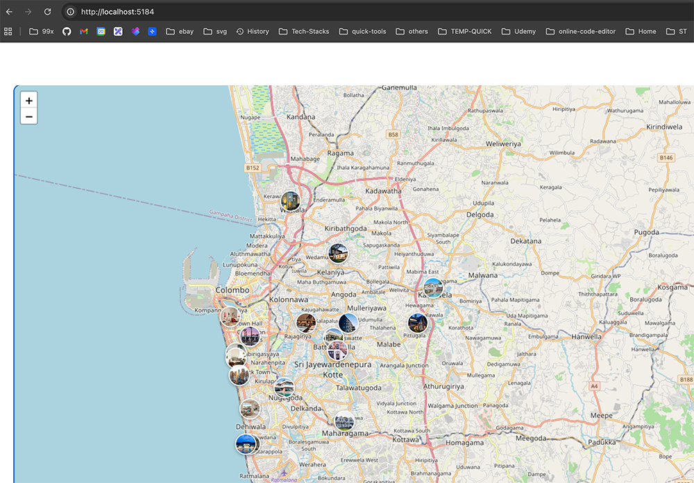

# Map Remote MFE

`map-remote-mfe` is a Remote Micro-Frontend application for the NestBoard ecosystem.

This application exposes map-related frontend modules to the host application using **Vite Module Federation**.

The remote application is responsible for rendering property map visualization features inside the NestBoard Shell Application.



# Purpose

This micro-frontend provides:

- Property location visualization
- Interactive maps
- Map-based property exploration
- Reusable map modules for the host application

The host application dynamically loads this remote at runtime.

---

# Micro-Frontend Architecture

This project acts as a **Remote MFE** inside the NestBoard Micro-Frontend ecosystem.

## Architecture flow:

```txt
NestBoard Host Application
            ↓
Loads remoteEntry.js
            ↓
map-remote-mfe
            ↓
Renders Map Components
```

## This application exposes frontend modules through:

- remoteEntry.js
- Vite Module Federation Plugin

## Technology Stack

### Frontend:

React 19

- TypeScript
- Vite
- Vite Module Federation Plugin
- React Router
- TanStack Query
- Tailwind CSS
- Map Libraries
- Leaflet
- React Leaflet

### Exposed Features

The remote application exposes:

Map pages
Map UI components
Property location rendering
Reusable map modules

These modules are consumed by the NestBoard Host Application.

Local Development

Follow these steps to run the remote micro-frontend locally.

1. Clone the Repository
   git clone git@github.com:abhimax/nest-board-micro-frontends.git
   cd map-remote-mfe
2. Install Dependencies
   npm install
3. Start Development Server
   npm run dev

The remote application will run on:

http://localhost:5174
Production Preview

To build and preview the production version:

npm run build
npm run preview

Preview URL:

http://localhost:5184
Module Federation

This application exposes remote modules using:

@originjs/vite-plugin-federation

The host application dynamically consumes these modules at runtime.

### Example flow

```txt
Host Application
      ↓
Fetches remoteEntry.js
      ↓
Loads exposed modules
      ↓
Renders Map Features
```

## Scripts

- npm run dev : Start development server
- npm run build : Create production build
- npm run preview : Preview production build
- npm run serve : Build and preview application
- npm run typecheck : Run TypeScript type checking

## Development Notes

This application is designed to work together with the NestBoard Host Application.
The host application must be running to fully test integrated features.
Shared dependencies are managed through Module Federation.
Remote modules are loaded dynamically at runtime.

## Related Projects

- nest-board-host-mfe - Shell / Host Application
- nest-board-api - Backend API Simulation
