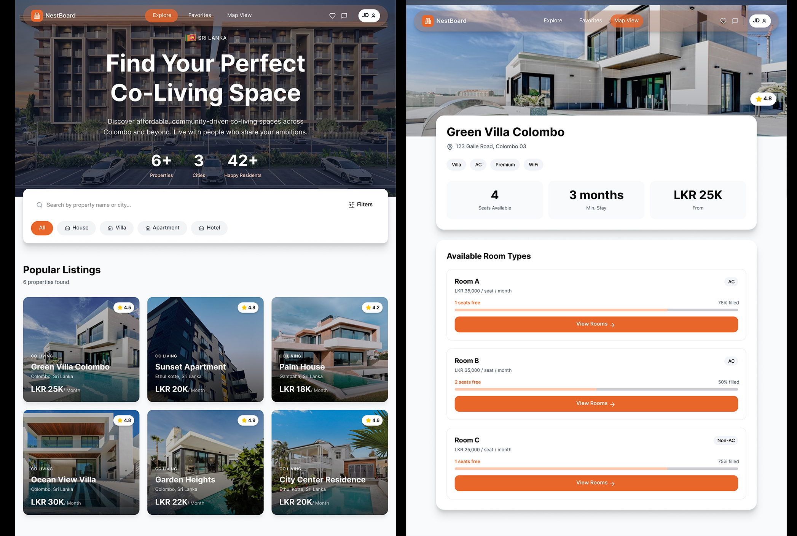

Here’s a polished and more structured version of your README.md with better readability, consistent formatting, and small enhancements:

# NestBoard Frontend

**NestBoard** is a co-living space booking platform that allows users to **explore, book, and manage properties** such as **apartments**, **villas**, and **houses**. It provides a clean, user-friendly interface for discovering available spaces, filtering by city and price, viewing detailed property information, and making bookings seamlessly.


---

### User-Facing Features

- **Home Page**: Browse a list of available properties with advanced filtering options such as location, price range, and property type.
- **Property Detail Page**: View detailed information about properties, including available rooms, pricing, facilities, and images.
- **Bookings**: Reserve rooms directly from the property detail page and manage existing bookings.
- **User Profile**: Manage personal details, view booking history, and save favorite properties for quick access.
- **Dynamic Theme Switching**: The UI adapts dynamically based on the user type (normal user or admin).

### Admin Features

- **Admin Dashboard**: Manage all properties and users in one centralized dashboard.
- **Add/Edit/Delete Properties**: Create new listings, update property details, and remove listings as needed.
- **Room Management**: Manage room availability, pricing, and details for each property.
- **User Management**: View registered users, assign roles, and manage access permissions.
- **Admin-Specific Theme**: A distinct interface for admins that visually separates admin functionalities from the user-facing application.

## User Roles

- **Normal User**: Can browse properties, view property details, make bookings, and manage personal profile.
- **Admin User**: Has full access to CRUD (Create, Read, Update, Delete) operations for properties and rooms, as well as user management capabilities.

## Technology Stack

- **Frontend**:
  - **React with TypeScript** – Core framework for building the UI with type safety.
  - **Vite v2** – Development and build tool for fast bundling and hot module replacement.
  - **ChatCN UI** – Component library used for prebuilt UI components.
  - **Tailwind CSS** – Utility-first CSS framework for styling.
  - **TanStack Query** – For data fetching, caching, and server state management.
  - **Zustand** – Global state management solution for React.
  - **React Router** – Handles client-side routing.
  - **Clerk** – Authentication and authorization management for user login and roles.

- **Backend**:
  - **Node.js** – Runtime environment for the backend server.
  - **Express.js** – Web framework to handle API routes and server logic.
  - **Dummy Backend** – Simulated backend for development and testing purposes.

## Getting Started

Follow these steps to run NestBoard locally:

### 1. Clone the repository

```bash
git clone https://github.com/abhimax/nest-board-fe
cd nestboard
```

### 2. Install Dependencies

```bash
npm install
```

### 3. Start the Development Server

```bash
npm run dev
```

The app will be available at http://localhost:5183 (or the port shown in the terminal).

### 4. Build for Production

```bash
npm run build
```

This will create an optimized production build in the dist/ folder.

# API Simulation

**Repository**: https://github.com/abhimax/nest-board-api

### 1. **Clone the Backend Repository**

```bash
git clone <backend-repo-url>
```

### 2. **got to project folder**

```bash
cd <backend-folder>
```

### 3. **install dependencies**

```bash
npm install
```

### 4. **Start the server**

```bash
npm start
```

## Available API Endpoints:

- GET /properties – List all properties.
- GET /properties/:id – Get property details.
- POST /properties – Add a new property.
- PUT /properties/:id – Edit an existing property.
- DELETE /properties/:id – Delete a property.

⚠️ This backend is required to run the frontend application properly.
