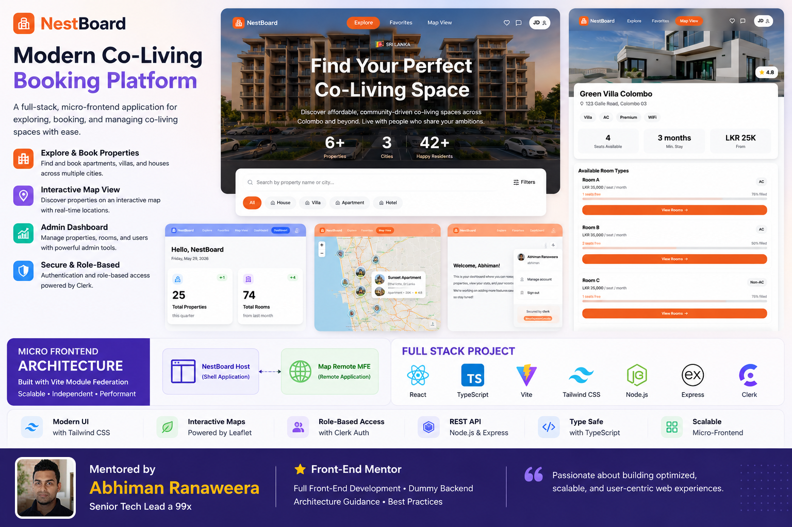
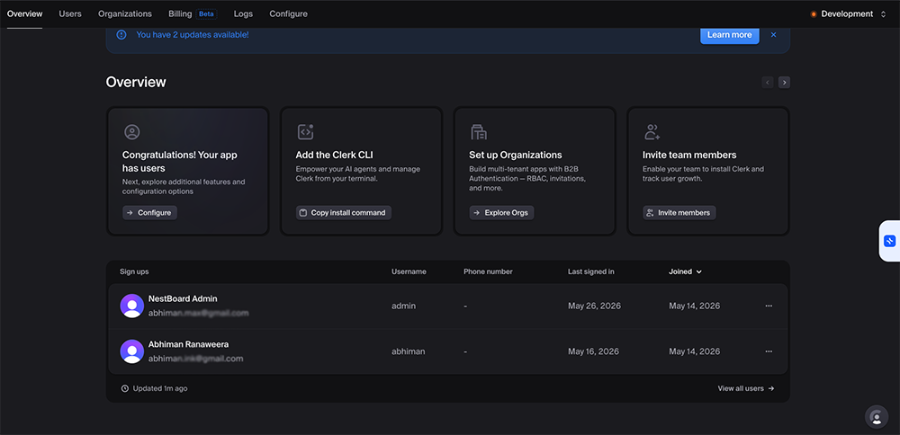

# NestBoard Frontend

**NestBoard** is a co-living space booking platform that allows users to **explore, book, and manage properties** such as **apartments**, **villas**, and **houses**.

This application now follows a **Micro-Frontend Architecture** using **Vite Module Federation**.

This repository represents the **Shell / Host Application** of the NestBoard frontend ecosystem.



---

# Micro-Frontend Architecture

NestBoard frontend is structured using a **Shell + Remote Micro-Frontend** architecture.

## Shell Application (This Repository)

The shell application is responsible for:

- Main application layout
- Routing
- Authentication
- Global state management
- Shared UI structure
- Loading remote micro-frontends dynamically

## Remote Micro-Frontend

The shell application integrates a remote micro-frontend:

| Micro-Frontend   | Responsibility                                      |
| ---------------- | --------------------------------------------------- |
| `map-remote-mfe` | Property map visualization and map-related features |

The remote application is dynamically loaded into the shell using the **Vite Module Federation Plugin**.

---

# User-Facing Features

- **Home Page**: Browse a list of available properties with filtering options such as location, price range, and property type.
- **Property Detail Page**: View detailed property information including rooms, pricing, facilities, and images.
- **Bookings**: Reserve rooms directly from the property detail page and manage existing bookings.
- **User Profile**: Manage personal details, booking history, and saved properties.
- **Map Integration**: View property locations using the remote Map Micro-Frontend.
- **Dynamic Theme Switching**: UI adapts based on user roles.

---

# Admin Features

- **Admin Dashboard**
- **Add/Edit/Delete Properties**
- **Room Management**
- **User Management**
- **Admin-Specific Theme**

---

# User Roles

## Normal User

- Browse properties
- View property details
- Make bookings
- Manage personal profile

## Admin User

- Full CRUD access
- Property and room management
- User management capabilities

---

# Technology Stack

## Frontend

- **React with TypeScript**
- **Vite**
- **Vite Module Federation Plugin**
- **shadcn/ui**
- **Tailwind CSS**
- **TanStack Query**
- **Zustand**
- **React Router**
- **Clerk Authentication**

## Backend

- **Node.js**
- **Express.js**
- **Dummy Backend API**

---

# Getting Started

Follow these steps to run NestBoard locally.

---

## 1. Configure Clerk Authentication

The host app requires Clerk authentication for protected routes such as the dashboard and admin pages.

1. Visit https://clerk.com and sign up.
2. Create a new Clerk application/project.
3. Register at least two users: a normal user and an admin user.
4. In `nest-board-host-mfe/`, create a `.env` file and add:

```bash
VITE_CLERK_PUBLISHABLE_KEY=your_publishable_key_here
```


Note: `.env` is included in `.gitignore`, so your key will not be committed.

## 2. Install Dependencies and Run the Host Application

```bash
git clone git@github.com:abhimax/nest-board-micro-frontends.git
cd nest-board-host-mfe
npm install
npm run dev
```

The shell application will run on:

```bash
http://localhost:5183
```

## 3. Run the Remote Map MFE

The shell application depends on the `map-remore-mfe` application for map-related functionality.

Make sure the remote micro-frontend is also running.

Example:

```bash
cd map-remore-mfe
npm install
npm run build
npm run preview
```

Example remote application URL:

```bash
http://localhost:5184
```

## Module Federation Integration

The shell application dynamically loads remote modules at runtime using the Vite Module Federation Plugin.

Architecture flow:

Shell Application (Host)
↓
Loads remoteEntry.js
↓
Map Remote MFE
↓
Renders Map Feature

Benefits of this architecture:

Independent feature development
Better scalability
Faster deployments
Team ownership separation
Lazy-loaded frontend modules
Build for Production
npm run build

This will create an optimized production build inside the dist/ folder.

API Simulation

Repository:
https://github.com/abhimax/nest-board-api

1. Clone the Backend Repository
   git clone <backend-repo-url>
2. Go to the Project Folder
   cd <backend-folder>
3. Install Dependencies
   npm install
4. Start the Backend Server
   npm start
   Available API Endpoints
   GET /properties
   GET /properties/:id
   POST /properties
   PUT /properties/:id
   DELETE /properties/:id

```

```
